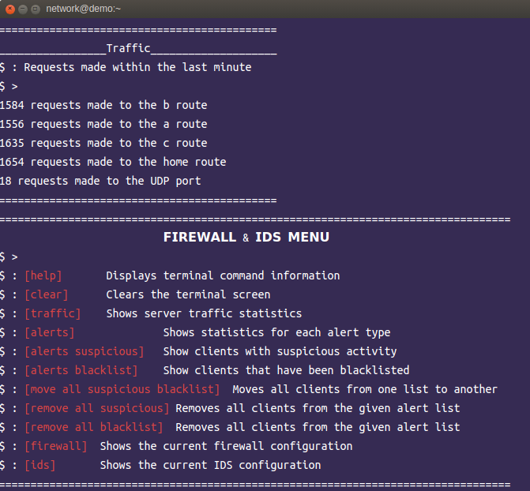

# Firewall and Intrusion Detection System (IDS) Demo

## Introduction
The goal of this project is to demonstrate cybersecurity defenses of enterprise networks by implementing and evaluating firewall configurations and Intrusion Detection Systems (IDS).



## Features
- **Firewall Configuration:** A firewall to control and monitor incoming and outgoing network traffic based on predefined security rules.

- **Intrusion Detection System (IDS):** An IDS to detect and respond to potential security threats and attacks within the network.

- **Rate Limiting:** Rate limiting to control the number of requests from clients and prevent abuse of server resources.

- **Client Tracking:** Tracks client activity and access patterns to identify suspicious behavior and potential security threats.

- **Error Handling:** Redirects clients to error pages or return appropriate status codes to handle blocked access or detected security threats.

## Usage
Clone the repository:
```bash 
git clone https://github.com/blakley/Firewall-And-IDS.git
```

## Installation

### Install dependencies:
```bash
pip install -r requirements.txt
```

## Run the application:
```bash
python3 server.py
```

### Access the application in your web browser:
```bash
http://localhost:9000/
```

### Configuration Notes

- **Firewall Rules:** Customize firewall rules in `firewall_config.json` to define allowed and denied traffic patterns.

- **Intrusion Detection System:** Configure IDS rules and thresholds in `ids_config.json` to detect and respond to security threats.

- **Rate Limiting:** Adjust rate limiting parameters in `server.py` to control the maximum number of requests from clients.

